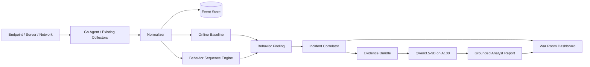

# NTAgentShield

**Behavioral Zero-Day Hunting + Grounded AI SOC Analyst** สำหรับติดตั้งใน server, endpoint
และ control plane ของ NT Shield

ระบบนี้ไม่ได้อ้างว่าโมเดล 9B มองเห็นช่องโหว่ที่โลกยังไม่รู้จักด้วยญาณพิเศษ สิ่งที่มันทำคือจับ
**พฤติกรรมหลังการเจาะระบบ** จากหลายแหล่ง เชื่อมเป็น attack chain แล้วส่งเฉพาะหลักฐานที่เกี่ยวข้อง
ให้ Qwen3.5-9B วิเคราะห์โดยบังคับให้อ้าง `event_id` จริงทุกข้อสรุป

## สิ่งที่มีใน MVP นี้

- Online behavioral baseline ต่อ `tenant + asset + role`
- Ordered sequence detection ภายใน time window
- 13 hunting chains สำหรับ Windows, Linux, Web, Network และ Database
- Incident correlation จาก asset, user, IP, domain, hash และ request ID
- Risk scoring จาก rule confidence, anomaly, asset criticality และ telemetry diversity
- Normalizer สำหรับ Sysmon, Windows Security Event, IIS/Nginx/Apache, auditd และ DB audit
- Qwen3.5-9B ผ่าน OpenAI-compatible API พร้อม prompt-injection guard
- Output validator ปฏิเสธรายงานที่โมเดลแต่ง `event_id`
- FastAPI, SQLite WAL, REST API และหน้า War Room
- Go transport agent ที่มี local spool เมื่อส่งข้อมูลไม่ได้
- Attack replay และ test suite

## Architecture



ดูรายละเอียดที่ [docs/ARCHITECTURE.md](docs/ARCHITECTURE.md) และ
[docs/BEHAVIORAL-ZERO-DAY.md](docs/BEHAVIORAL-ZERO-DAY.md)

## เริ่มใช้งานเร็ว

### 1. รัน Qwen3.5-9B บน A100

ติดตั้ง vLLM รุ่นที่รองรับ Qwen3.5 แล้วรัน:

```bash
./deploy/run-qwen-a100.sh
```

ค่าเริ่มต้นใช้ text-only mode, context 65,536 tokens และพอร์ต `8000` เพื่อเหลือ VRAM สำหรับ
concurrency มากกว่าการเปิด 262K ให้ทุก request แล้วเฝ้าดู KV cache กินเครื่องอย่างสง่างาม

### 2. รัน NTAgentShield

```bash
python -m venv .venv
source .venv/bin/activate
python -m pip install -e '.[dev]'
cp .env.example .env
ntshield serve --host 0.0.0.0 --port 8080
```

เปิด `http://SERVER:8080` แล้วกด **Replay attack chain** เพื่อดูเหตุการณ์จำลอง

หรือใช้ Docker:

```bash
cp .env.example .env
docker compose up --build
```

### 3. Replay ผ่าน CLI

```bash
ntshield replay examples/zero_day_web_chain.jsonl
```

ผลที่คาดหวัง:

```text
[CRITICAL ...] BZH-WEB-001: Novel web request followed by post-exploitation chain
```

## API ที่สำคัญ

```text
POST /v1/events/normalized
POST /v1/events/raw
POST /v1/events/bulk
POST /v1/events/raw/bulk
GET  /v1/findings?tenant_id=demo
GET  /v1/incidents?tenant_id=demo
POST /v1/incidents/{id}/analyze
GET  /v1/coverage
GET  /v1/stats?tenant_id=demo
GET  /health
```

ตัวอย่างส่ง Sysmon event ที่ยังไม่ normalize:

```bash
curl -X POST http://127.0.0.1:8080/v1/events/raw \
  -H 'Content-Type: application/json' \
  -d '{
    "tenant_id":"customer-a",
    "asset_id":"web-01",
    "asset_role":"public-web",
    "asset_criticality":5,
    "source_type":"sysmon",
    "data":{
      "EventID":1,
      "Image":"C:\\Windows\\System32\\WindowsPowerShell\\v1.0\\powershell.exe",
      "ParentImage":"C:\\Windows\\System32\\inetsrv\\w3wp.exe",
      "CommandLine":"powershell.exe -NoProfile ...",
      "User":"IIS APPPOOL\\Production"
    }
  }'
```

## Behavioral rule format

กฎอยู่ใน `rules/behavioral/*.yaml` และเป็นลำดับเหตุการณ์ ไม่ใช่ keyword เดี่ยว ๆ:

```yaml
id: BZH-WEB-001
window_seconds: 300
group_by: [tenant_id, asset.id]
steps:
  - id: novel_request
    match:
      event_type: web.request
      web.payload_novelty|gte: 0.75
  - id: service_shell
    within_seconds: 120
    match:
      event_type: process.start
      process.parent_name|in: [w3wp.exe, nginx, apache2]
      process.name|in: [powershell.exe, cmd.exe, sh, bash]
```

Matcher รองรับ `in`, `not_in`, `contains`, `one_of_contains`, `regex`, `gt/gte/lt/lte`,
`cidr`, `not_cidr`, `starts/endswith` และ `exists`

## Qwen ทำหน้าที่อะไร

Qwenไม่ได้ตรวจ raw log ทุกบรรทัด ระบบ deterministic จะคัด event และประกอบ incident ก่อน จากนั้น
Qwenรับ evidence bundle เพื่อ:

- สรุป attack chain ภาษาไทยหรืออังกฤษ
- แยก observation, inference และ evidence gap
- ประเมินสมมติฐาน unknown/zero-day โดยห้ามยืนยันเกินหลักฐาน
- เสนอ read-only investigation queries
- เสนอ response action พร้อม `requires_approval`

ข้อความใน log, URL, SQL, command line และไฟล์ถูกถือเป็น **untrusted data** ทั้งหมด รายงานถูก reject
ทันทีเมื่ออ้าง event ID ที่ไม่มีจริง

## Go agent

```bash
make agent
./agent/ntshield-agent \
  --server http://127.0.0.1:8080 \
  --tenant customer-a \
  --asset web-01 \
  --role public-web \
  --criticality 5 \
  --source sysmon \
  --input ./sysmon.jsonl
```

MVP agent เป็น secure transport adapter ยังไม่ใช่ kernel EDR รายละเอียด collector ระยะถัดไปอยู่ใน
[docs/ROADMAP.md](docs/ROADMAP.md)

## ทดสอบ

```bash
make dev
make lint
make test
cd agent && go test ./... && go build ./cmd/ntshield-agent
```

## ข้อจำกัดที่ตั้งใจไว้

- ไม่มี auto-block, auto-kill หรือ auto-isolate ใน MVP
- SQLite เหมาะกับ demo และ site ขนาดเล็ก ก่อนย้าย event store ไป ClickHouse/OpenSearch
- Baseline ต้องมีช่วงเรียนรู้และ allowlist ตาม asset role
- ATT&CK mapping เป็น context สำหรับ analyst ไม่ใช่หลักฐานว่าการโจมตีเกิดขึ้นจริง
- “zero-day” เป็น hypothesis เท่านั้นจนกว่าจะมี exploit reproduction, affected version และการยืนยันจากมนุษย์

License: Apache-2.0
