# NTAgentShield

**Behavioral Zero-Day Hunting + Secure AI Endpoint Agent** สำหรับ Windows, Linux, Server และ Endpoint

NTAgentShield แบ่งระบบเป็นสองส่วนที่ทำงานร่วมกัน:

1. **Control Plane** ที่ root ของ repository ใช้ Python/FastAPI สำหรับ normalize telemetry, behavioral baseline, correlation, incident scoring, evidence-backed AI analysis, Agent enrollment และ War Room API
2. **Endpoint Agent** ที่ `agent/` ใช้ Go สำหรับ asset inventory, native OS telemetry, log/code inspection, deterministic detection, secret redaction, tamper-evident evidence, signed identity และ durable mTLS telemetry transport โดยไม่มี generic shell ให้ AI ใช้

ระบบไม่ได้อ้างว่ารู้จักช่องโหว่ที่ยังไม่มีใครรู้จักล่วงหน้า สิ่งที่ระบบทำคือมองหา **พฤติกรรม exploitation และ post-exploitation** จากหลายแหล่ง เชื่อมเป็น attack chain แล้วให้ Qwen วิเคราะห์เฉพาะหลักฐานที่ผ่านขอบเขตความไว้วางใจแล้ว

## Architecture

```mermaid
flowchart LR
  A[Windows / Linux / IIS / Nginx / DB / Firewall / Source Code] --> B[Go Endpoint Agent]
  B --> C[Native Telemetry + Inventory + Log Collection]
  C --> D[Recursive Redaction + Deterministic Detection]
  D --> E[Hash-chained Evidence Journal]
  D --> F[Durable Disk Outbox]
  F --> G[Ed25519 Signed Event + mTLS]
  G --> H[Python Control Plane]
  H --> I[Enrollment Registry + Signature/Tenant Validation]
  I --> J[Online Baseline + Sequence Engine]
  J --> K[Incident Correlator + Risk Scoring]
  K --> L[Evidence Bundle]
  L --> M[Read-only Qwen Analyst]
  M --> N[War Room / Incident API]
```



## สิ่งที่มีแล้ว

### Behavioral Control Plane

- Online baseline ต่อ `tenant + asset + role`
- Ordered และ unordered multi-event correlation ภายใน time window
- Behavior packs สำหรับ Web exploitation, credential access, database exfiltration, defense evasion, persistence, account compromise และ supply-chain execution
- Normalizer สำหรับ Sysmon, Windows Event Log, IIS, Nginx, Apache, Linux auditd และ database audit
- Incident correlation จาก asset, user, IP, domain, hash และ request ID
- Risk scoring จาก rule confidence, anomaly, asset criticality และ telemetry diversity
- Qwen ผ่าน OpenAI-compatible API พร้อม prompt-injection guard และ evidence-ID validation
- FastAPI, SQLite WAL, REST API, replay corpus และ War Room
- Signed tenant-scoped Agent enrollment token พร้อม one-time nonce ที่ persist ใน SQLite
- Enrollment CA และการออก Ed25519 ClientAuth certificate
- Enrolled Agent registry สำหรับผูก `tenant + agent + certificate`
- Signed Agent telemetry ingest ที่ตรวจ certificate registry, Ed25519 body signature, Tenant/Agent binding และ duplicate event ID ก่อนเข้า hunting engine
- TLS/mTLS listener mode สำหรับ Control Plane

### Secure Endpoint Agent

- Agent daemon และ CLI สำหรับ Windows/Linux
- Native asset inventory สำหรับ OS, network interfaces, process, service, listening socket และ installed software/package
- Native Windows Event Log และ Sysmon collector พร้อม cursor ที่ persist หลัง processing สำเร็จ
- Native Linux journald และ auditd collector พร้อม bounded command/file collection
- Parsers สำหรับ IIS W3C, Nginx combined, MySQL general log, Syslog, normalized JSON และ raw text
- Deterministic detections สำหรับ prompt injection ใน telemetry, encoded PowerShell, web-worker-to-shell, path traversal, high-risk SQL, security-control disabling, webroot writes และ authentication bursts
- Native high-signal detections สำหรับ log clear, process tampering, remote thread, scheduled task, service creation, account creation, audit disabling และ SELinux denial
- Inventory drift detection สำหรับ service ใหม่/startup mode, listener ใหม่, software ใหม่ และ suspicious process ancestry
- Code-security scanner สำหรับ secret, command execution, dynamic evaluation, SQL concatenation, TLS bypass, unsafe deserialization, Docker/GitHub Actions และ PHP web-shell patterns
- SHA-256 hash-chained evidence journal
- Recursive secret redaction สำหรับ map, array, nested struct, command-line flag และ URI credentials
- Machine ID และ Boot ID ถูกเก็บเป็น scoped SHA-256 hash ไม่เก็บค่า OS identifier ดิบ
- Persistent Ed25519 Agent identity key และ fingerprint
- Persistent inventory baseline ที่เซ็นด้วย Agent identity และตรวจ signature ก่อนใช้หลัง restart
- Enrollment CLI สำหรับสร้าง CSR, รับ client certificate และตรวจว่ certificate ผูกกับ public key ของ Agent จริง
- Explicit Go → Python event-schema mapping ไม่โยน JSON คนละ schema ข้ามฝั่งแบบเดาสุ่ม
- Durable disk outbox สำหรับ telemetry พร้อม idempotent event queue, ACK-after-2xx, retry, exponential backoff, dead-letter และ backpressure status
- mTLS telemetry sender พร้อม Ed25519 signature ของ exact request body
- Typed read-only tools พร้อม path allowlist และ symlink resolution
- Policy engine ที่ปฏิเสธ generic shell และห้าม untrusted telemetry สั่งเปลี่ยนระบบโดยตรง
- Loopback-only authenticated local API ที่ไม่มี command endpoint
- Optional read-only AI investigator สำหรับ Qwen/Ollama/vLLM โดยไม่ส่ง tool definitions ให้โมเดล

## Security invariants

1. Log, HTTP field, SQL comment, source comment, process command line, RAG document และ network data เป็น untrusted evidence เสมอ
2. AI analyst ไม่มี generic shell และไม่มี privileged action tool
3. Tool risk มาจาก registry ไม่รับค่าจากโมเดล
4. Untrusted evidence ไม่สามารถ trigger containment หรือ mutation โดยตรง
5. State-changing action ต้องผ่าน deterministic policy, exact action digest และ approval ที่มีวันหมดอายุ
6. Secret ถูก redact ก่อน journal, baseline, transport และ AI context รวมถึงข้อมูลที่ซ้อนอยู่ใน inventory struct
7. Native inventory/collector ใช้เฉพาะ command และ argument ที่กำหนดตายตัวใน code พร้อม timeout และ result cap
8. Tenant, asset และ time scope ถูกบังคับโดยระบบ ไม่ให้โมเดลขยายเอง
9. Agent telemetry ต้องผ่าน enrollment registry + certificate validity + Ed25519 signature + signed Tenant/Agent binding
10. Queued telemetry ถูกลบเมื่อ Control Plane ตอบสำเร็จเท่านั้น; payload ที่แก้ไม่ได้ถูกเก็บใน dead-letter พร้อมเหตุผล
11. รายงาน AI ที่อ้าง evidence ID ไม่มีจริงจะถูกปฏิเสธ
12. Zero-day เป็น hypothesis จนกว่าจะมี reproduction และการยืนยันจากมนุษย์

## โครงสร้าง Repository

```text
.
├── src/                     # Behavioral control plane
├── tests/                   # Python tests
├── rules/                   # Behavioral hunting rules
├── deploy/                  # Qwen/A100 deployment helpers
├── agent/                   # Full Go endpoint/server agent
│   ├── cmd/                 # daemon, ctl, inventory, enrollment CLI
│   ├── internal/
│   │   ├── collector/       # file + native Windows/Linux telemetry
│   │   ├── inventory/       # native asset inventory
│   │   ├── detection/       # deterministic + drift/ancestry detections
│   │   ├── identity/        # persistent Ed25519 Agent identity
│   │   ├── baseline/        # signed persistent inventory baseline
│   │   ├── enrollment/      # CSR/enrollment + mTLS client setup
│   │   └── transport/       # schema mapping, durable outbox, signed mTLS sender
│   ├── config/
│   ├── policies/
│   ├── schemas/
│   ├── packaging/
│   └── docs/
├── docs/                    # architecture, enrollment, transport and roadmap
└── examples/                # replay corpus and examples
```

## เริ่มใช้งาน Control Plane

```bash
python -m venv .venv
source .venv/bin/activate
python -m pip install -e '.[dev]'
cp .env.example .env
ntshield serve --host 0.0.0.0 --port 8080
```

หรือใช้ Docker:

```bash
cp .env.example .env
docker compose up --build
```

Replay attack chain:

```bash
ntshield replay examples/zero_day_web_chain.jsonl
```

## Enrollment และ mTLS

สร้าง Enrollment CA ครั้งแรก:

```bash
export NTSHIELD_ENROLLMENT_ENABLED=true
export NTSHIELD_ENROLLMENT_SIGNING_SECRET='replace-with-a-long-random-secret'
ntshield init-ca
```

สร้าง token อายุสั้นสำหรับ Tenant:

```bash
ntshield enrollment-token --tenant demo-tenant --ttl 600 > enrollment.token
```

บน Endpoint:

```bash
cd agent
go run ./cmd/ntagentshield-enroll \
  --config config/agent.example.json \
  --endpoint https://control.example/v1/enrollment \
  --token-file enrollment.token
```

รายละเอียด: [Signed Agent Enrollment and mTLS](docs/ENROLLMENT-MTLS.md)

## Build และทดลอง Endpoint Agent

ต้องใช้ Go 1.23 หรือใหม่กว่า

```bash
cd agent
go test ./...
go build ./cmd/ntagentshield-agent \
  ./cmd/ntagentshieldctl \
  ./cmd/ntagentshield-inventory \
  ./cmd/ntagentshield-enroll
```

ดู Asset Inventory ของเครื่อง:

```bash
go run ./cmd/ntagentshield-inventory \
  --processes=true \
  --services=true \
  --listeners=true \
  --software=true \
  --max-items 512
```

ตรวจ IIS log:

```bash
go run ./cmd/ntagentshieldctl scan-log \
  --format iis_w3c \
  --file examples/logs/iis.log
```

ตรวจ event chain:

```bash
go run ./cmd/ntagentshieldctl scan-event \
  --file examples/events/web-worker-shell.json
```

ตรวจ source code:

```bash
go run ./cmd/ntagentshieldctl scan-code \
  --path examples/code
```

รัน Agent:

```bash
go run ./cmd/ntagentshield-agent \
  --config config/agent.example.json
```

เปิด `transport.enabled=true` หลัง enrollment เพื่อส่ง telemetry ผ่าน signed mTLS transport ดูรายละเอียดที่ [Durable Signed Agent Telemetry Transport](docs/AGENT-TRANSPORT.md)

รายละเอียด Agent เพิ่มเติมอยู่ที่ [agent/README.md](agent/README.md)

## API หลักของ Control Plane

```text
POST /v1/enrollment
POST /v1/agent/events
POST /v1/events/normalized
POST /v1/events/raw
POST /v1/events/bulk
POST /v1/events/raw/bulk
GET  /v1/findings?tenant_id=demo
GET  /v1/incidents?tenant_id=demo
POST /v1/incidents/{id}/analyze
GET  /v1/coverage
GET  /v1/stats?tenant_id=demo
GET  /health
```

## ทดสอบทั้งระบบ

```bash
make dev
make lint
make test
make agent-test
make agent-race
make agent
```

CI ทดสอบ Python บน Linux และ Go Agent บน Linux/Windows พร้อม `go vet`, race test, inventory/enrollment binary build, formatting gate, signed enrollment tests, durable outbox tests และ real mutual-TLS sender test

## ขอบเขตถัดไป

- Windows ETW collector สำหรับ telemetry ที่ละเอียดขึ้น
- Linux eBPF telemetry สำหรับ process/network/file activity แบบ kernel-level
- Automatic client-certificate renewal และ operator-facing Agent revocation/fleet state
- Signed policy distribution พร้อม version, rollback protection และ signed update
- Disk-budget/retention policy และ signed bulk envelope สำหรับ high-EPS telemetry
- Production response broker สำหรับ quarantine, process containment และ host isolation
- Multi-tenant fleet policy, central correlation และ customer reporting
- Model evaluation และ adversarial prompt/tool-injection benchmark

เอกสารสำคัญ:

- [Control-plane architecture](docs/ARCHITECTURE.md)
- [Behavioral zero-day hunting](docs/BEHAVIORAL-ZERO-DAY.md)
- [Signed Agent Enrollment and mTLS](docs/ENROLLMENT-MTLS.md)
- [Durable Signed Agent Telemetry Transport](docs/AGENT-TRANSPORT.md)
- [Control-plane roadmap](docs/ROADMAP.md)
- [Endpoint Agent](agent/README.md)
- [Agent architecture](agent/docs/ARCHITECTURE.md)
- [Agent threat model](agent/docs/THREAT_MODEL.md)
- [Agent AI security](agent/docs/AI_SECURITY.md)

License: Apache-2.0
