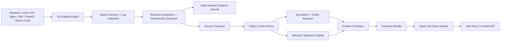

# NTAgentShield

**Behavioral Zero-Day Hunting + Secure AI Endpoint Agent** สำหรับ Windows, Linux, Server และ Endpoint

NTAgentShield แบ่งระบบเป็นสองส่วนที่ทำงานร่วมกัน:

1. **Control Plane** ที่ root ของ repository ใช้ Python/FastAPI สำหรับ normalize telemetry, ทำ behavioral baseline, correlation, incident scoring, evidence-backed AI analysis และ War Room API
2. **Endpoint Agent** ที่ `agent/` ใช้ Go สำหรับเก็บ asset inventory, อ่าน log, ตรวจ code และพฤติกรรมในเครื่อง, redact secret, เก็บ evidence แบบ tamper-evident และส่งข้อมูลไป Control Plane โดยไม่มี generic shell ให้ AI ใช้

ระบบไม่ได้อ้างว่ารู้จักช่องโหว่ที่ยังไม่มีใครรู้จักล่วงหน้า สิ่งที่ระบบทำคือมองหา **พฤติกรรม exploitation และ post-exploitation** จากหลายแหล่ง เชื่อมเป็น attack chain แล้วให้ Qwen วิเคราะห์เฉพาะหลักฐานที่ผ่านขอบเขตความไว้วางใจแล้ว

## Architecture



## สิ่งที่มีแล้ว

### Behavioral Control Plane

- Online baseline ต่อ `tenant + asset + role`
- Ordered และ unordered multi-event correlation ภายใน time window
- Behavior packs สำหรับ Web exploitation, credential access, database exfiltration, defense evasion, persistence, account compromise และ supply-chain execution
- Normalizer สำหรับ Sysmon, Windows Event Log, IIS, Nginx, Apache, Linux auditd และ database audit
- Incident correlation จาก asset, user, IP, domain, hash และ request ID
- Risk scoring จาก rule confidence, anomaly, asset criticality และ telemetry diversity
- Qwen ผ่าน OpenAI-compatible API พร้อม prompt-injection guard และ evidence-ID validation
- FastAPI, SQLite WAL, REST API, replay corpus และ War Room

### Secure Endpoint Agent

- Agent daemon และ CLI สำหรับ Windows/Linux
- Native asset inventory สำหรับ OS, network interfaces, process, service, listening socket และ installed software/package
- Parsers สำหรับ IIS W3C, Nginx combined, MySQL general log, Syslog, normalized JSON และ raw text
- Deterministic detections สำหรับ prompt injection ใน telemetry, encoded PowerShell, web-worker-to-shell, path traversal, high-risk SQL, security-control disabling, webroot writes และ authentication bursts
- Code-security scanner สำหรับ secret, command execution, dynamic evaluation, SQL concatenation, TLS bypass, unsafe deserialization, Docker/GitHub Actions และ PHP web-shell patterns
- SHA-256 hash-chained evidence journal
- Recursive secret redaction สำหรับ map, array, nested struct, command-line flag และ URI credentials
- Machine ID และ Boot ID ถูกเก็บเป็น scoped SHA-256 hash ไม่เก็บค่า OS identifier ดิบ
- Typed read-only tools พร้อม path allowlist และ symlink resolution
- Policy engine ที่ปฏิเสธ generic shell และห้าม untrusted telemetry สั่งเปลี่ยนระบบโดยตรง
- Loopback-only authenticated local API ที่ไม่มี command endpoint
- Optional read-only AI investigator สำหรับ Qwen/Ollama/vLLM โดยไม่ส่ง tool definitions ให้โมเดล

## Security invariants

1. Log, HTTP field, SQL comment, source comment, process command line, RAG document และ network data เป็น untrusted evidence เสมอ
2. AI analyst ไม่มี generic shell และไม่มี privileged action tool
3. Tool risk มาจาก registry ไม่รับค่าจากโมเดล
4. Untrusted evidence ไม่สามารถ trigger containment หรือ mutation โดยตรง
5. State-changing action ต้องผ่าน deterministic policy, exact action digest และ approval ที่มีวันหมดอายุ
6. Secret ถูก redact ก่อน journal, transport และ AI context รวมถึงข้อมูลที่ซ้อนอยู่ใน inventory struct
7. Native inventory ใช้เฉพาะ command และ argument ที่กำหนดตายตัวใน code พร้อม timeout และ result cap
8. Tenant, asset และ time scope ถูกบังคับโดยระบบ ไม่ให้โมเดลขยายเอง
9. รายงาน AI ที่อ้าง evidence ID ไม่มีจริงจะถูกปฏิเสธ
10. Zero-day เป็น hypothesis จนกว่าจะมี reproduction และการยืนยันจากมนุษย์

## โครงสร้าง Repository

```text
.
├── src/                 # Behavioral control plane
├── tests/               # Python tests
├── rules/               # Behavioral hunting rules
├── deploy/              # Qwen/A100 deployment helpers
├── agent/               # Full Go endpoint/server agent
│   ├── cmd/
│   ├── internal/
│   │   └── inventory/   # Native Windows/Linux asset inventory
│   ├── config/
│   ├── policies/
│   ├── schemas/
│   ├── packaging/
│   └── docs/
├── docs/                # Control-plane architecture and roadmap
└── examples/            # Replay corpus and examples
```

## เริ่มใช้งาน Control Plane

```bash
python -m venv .venv
source .venv/bin/activate
python -m pip install -e '.[dev]'
cp .env.example .env
ntshield serve --host 0.0.0.0 --port 8080
```

หรือใช้ Docker:

```bash
cp .env.example .env
docker compose up --build
```

Replay attack chain:

```bash
ntshield replay examples/zero_day_web_chain.jsonl
```

## Build และทดลอง Endpoint Agent

ต้องใช้ Go 1.23 หรือใหม่กว่า

```bash
cd agent
go test ./...
go build ./cmd/ntagentshield-agent \
  ./cmd/ntagentshieldctl \
  ./cmd/ntagentshield-inventory
```

ดู Asset Inventory ของเครื่อง:

```bash
go run ./cmd/ntagentshield-inventory \
  --processes=true \
  --services=true \
  --listeners=true \
  --software=true \
  --max-items 512
```

ตรวจ IIS log:

```bash
go run ./cmd/ntagentshieldctl scan-log \
  --format iis_w3c \
  --file examples/logs/iis.log
```

ตรวจ event chain:

```bash
go run ./cmd/ntagentshieldctl scan-event \
  --file examples/events/web-worker-shell.json
```

ตรวจ source code:

```bash
go run ./cmd/ntagentshieldctl scan-code \
  --path examples/code
```

รัน Agent:

```bash
go run ./cmd/ntagentshield-agent \
  --config config/agent.example.json
```

รายละเอียด Agent อยู่ที่ [agent/README.md](agent/README.md)

## API หลักของ Control Plane

```text
POST /v1/events/normalized
POST /v1/events/raw
POST /v1/events/bulk
POST /v1/events/raw/bulk
GET  /v1/findings?tenant_id=demo
GET  /v1/incidents?tenant_id=demo
POST /v1/incidents/{id}/analyze
GET  /v1/coverage
GET  /v1/stats?tenant_id=demo
GET  /health
```

## ทดสอบทั้งระบบ

```bash
make dev
make lint
make test
make agent-test
make agent-race
make agent
```

CI ทดสอบ Python บน Linux และ Go Agent บน Linux/Windows พร้อม `go vet`, race test, inventory binary build และ formatting gate

## ขอบเขตถัดไป

- Native Windows Event Log, Sysmon และ ETW collectors
- Linux journald, auditd และ eBPF telemetry
- Inventory-delta detection สำหรับ service/listener/software drift และ process ancestry ที่ผิดปกติ
- Signed enrollment, mTLS, signed policy และ signed update
- Production response broker สำหรับ quarantine, process containment และ host isolation
- Multi-tenant fleet policy, central correlation และ customer reporting
- Model evaluation และ adversarial prompt/tool-injection benchmark

เอกสารสำคัญ:

- [Control-plane architecture](docs/ARCHITECTURE.md)
- [Behavioral zero-day hunting](docs/BEHAVIORAL-ZERO-DAY.md)
- [Control-plane roadmap](docs/ROADMAP.md)
- [Endpoint Agent](agent/README.md)
- [Agent architecture](agent/docs/ARCHITECTURE.md)
- [Agent threat model](agent/docs/THREAT_MODEL.md)
- [Agent AI security](agent/docs/AI_SECURITY.md)

License: Apache-2.0
